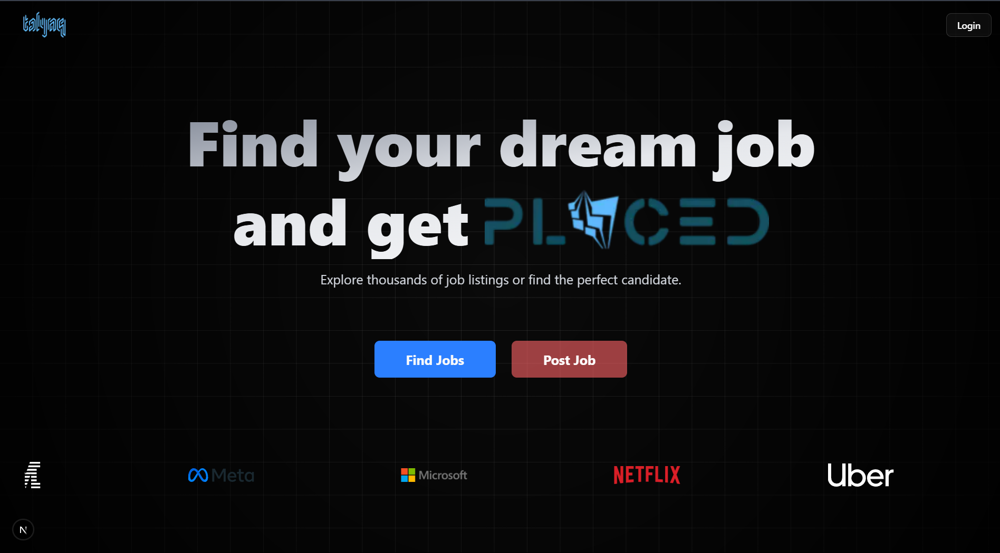
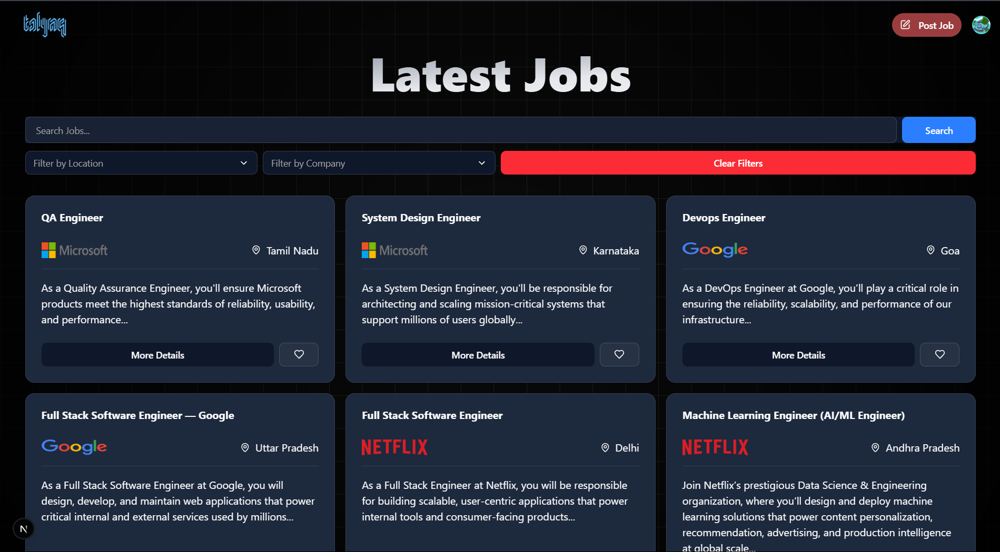
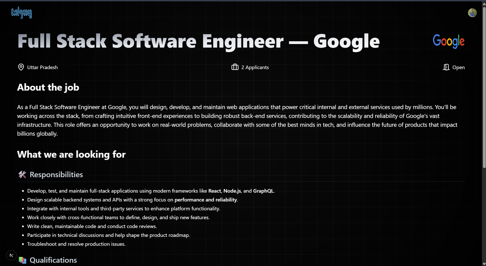
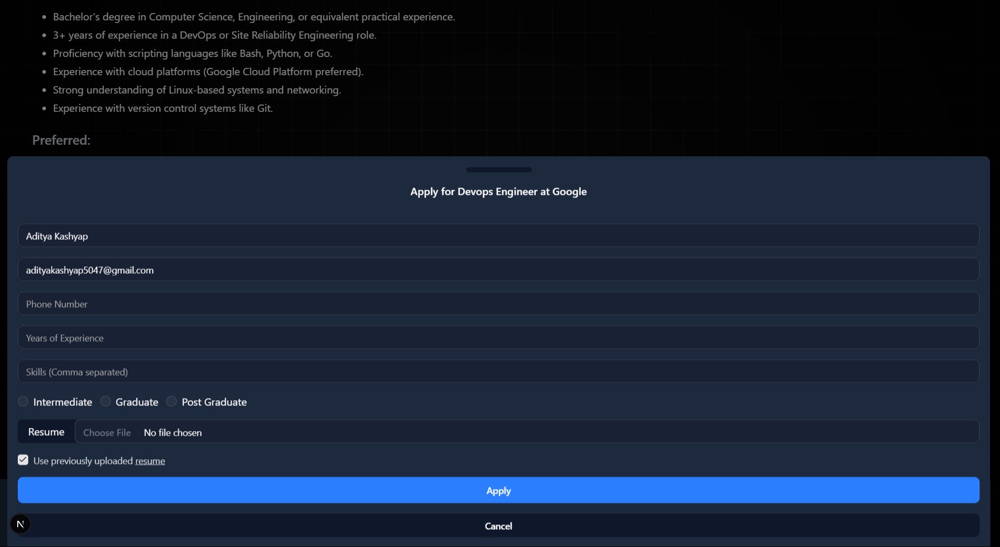
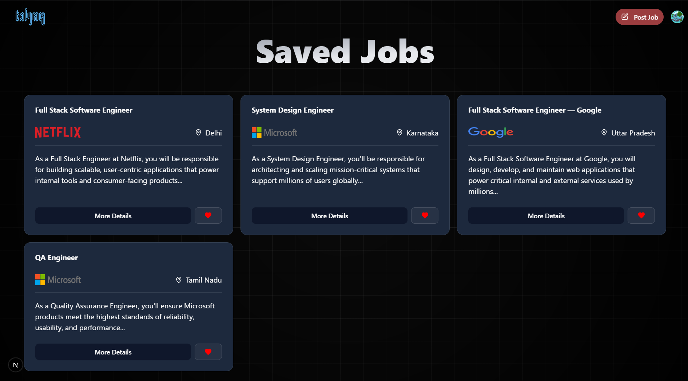
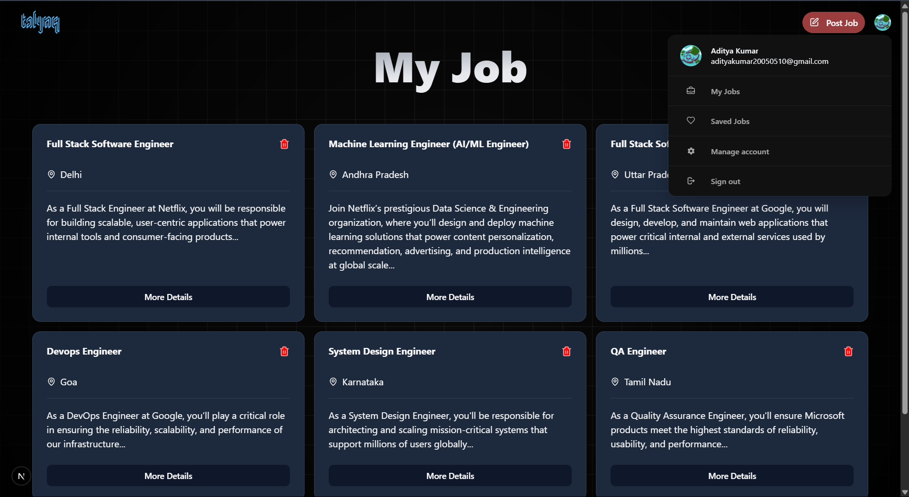
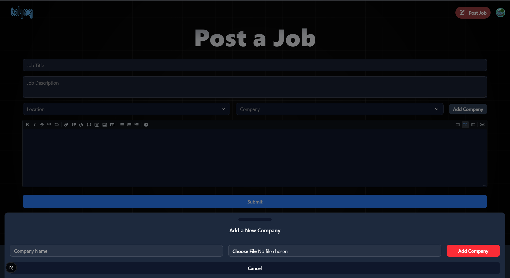
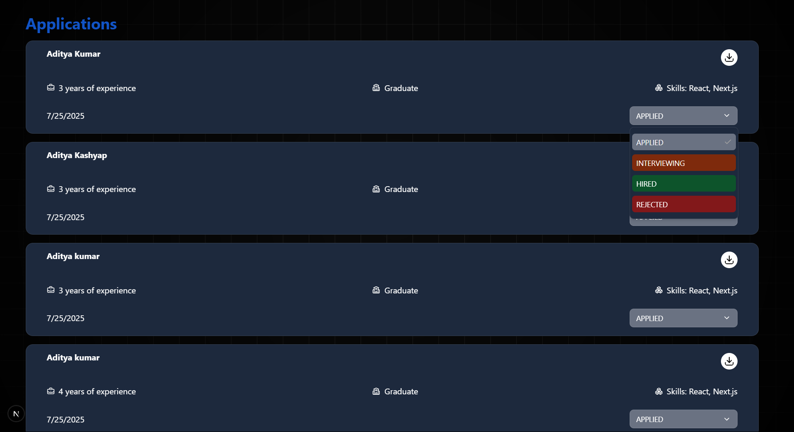
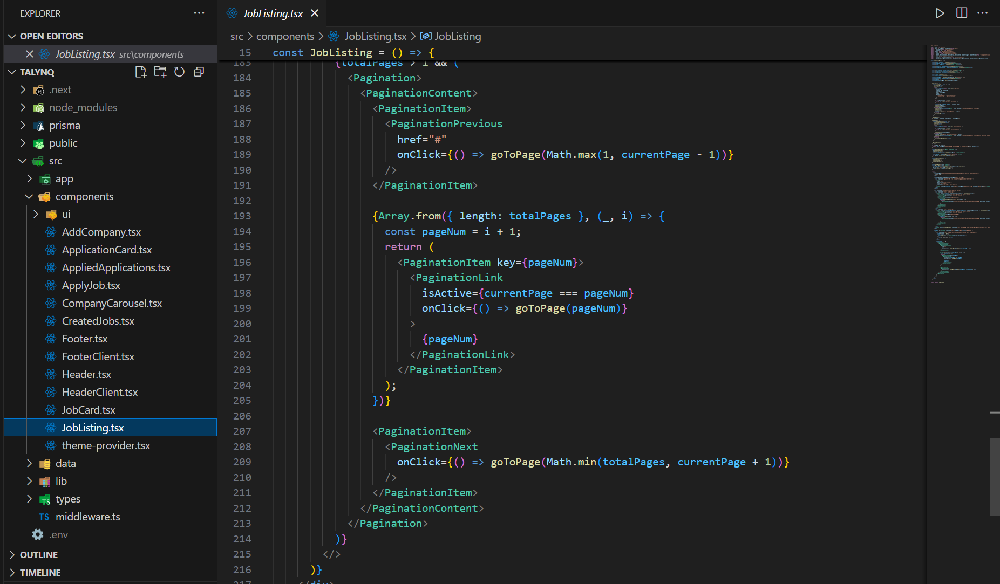
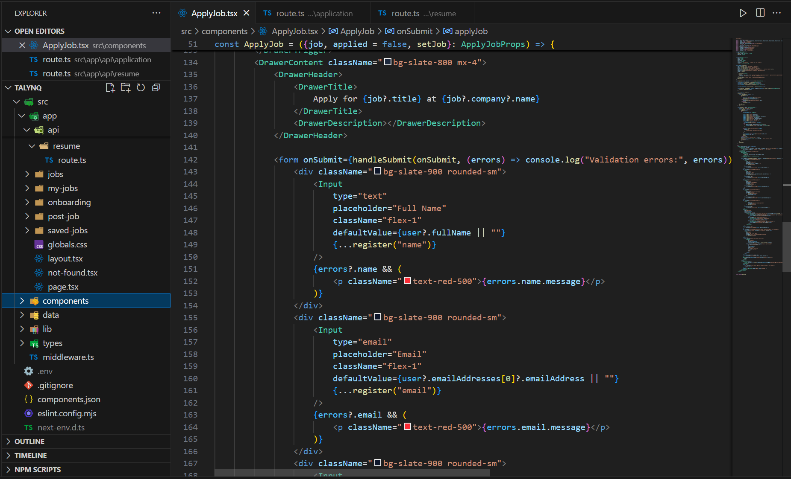

#  Talynq

**Talynq** is a modern job creation and talent discovery platform that connects skilled individuals with the right opportunities — faster, smarter, and easier.

---

## 🛠️ Tech Stack

- **Frontend**: React / Next.js / Tailwind CSS 
- **Backend**: Next.js API Routes / Prisma ORM  
- **Database**: PostgreSQL 
- **Authentication**: Clerk  
- **Form Handling & Validation**: React Hook Form / Zod  
- **UI Components**: Shadcn / Radix UI / Lucide Icons  

---

## 📸 Screenshots

<div align="center">
  
  
  
  
  
  
  
  
  
  
</div>

---

## 📦 Features

- 👤 User authentication & role management (Job Seeker / Recruiter)
- 📄 Create & manage job listings
- 📝 Apply to jobs with resumes
- 🔍 Smart search & filters
- 💬 Messaging system between recruiters & applicants
- 📊 Admin dashboard for analytics and management
- 📱 Fully responsive and mobile-friendly UI

---

## ⚙️ Getting Started

```bash
# Clone the repository
git clone https://github.com/adityakashyap5047/talynq.git

# Navigate to the project directory
cd talynq

# Install dependencies
npm install

# Rename the .env.example file to .env
mv .env.example .env

# Fill in the required environment variables in the .env file

# Start the development server
npm run dev

```
---

---

## 🌐 Live Demo
[](https://talynq.vercel.app)

---

## 💡 Future Enhancements

- AI-based job recommendations
- Resume parsing & scoring
- Video interviews & scheduling
- Push notifications
- Mobile app (React Native)

---

## 🤝 Contributing

Pull requests are welcome! For major changes, please open an issue first to discuss what you'd like to change.

---

## 📄 License

MIT

---

## ✨ Author

**Aditya Kumar**  
[LinkedIn](https://linkedin.com/in/adityakashyap5047) • [Portfolio](https://adityakashyap5047.vercel.app)

